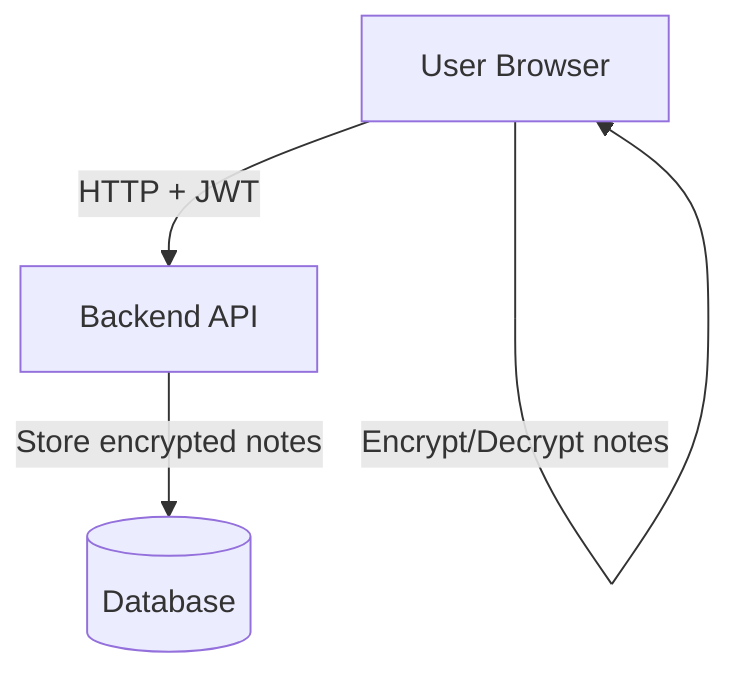

# BEMSI_2025L

## Projekt
**Szyfrowany Notatnik Medyczny** — nowoczesna, bezpieczna aplikacja webowa do zarządzania prywatnymi notatkami medycznymi z pełnym szyfrowaniem po stronie klienta.

---

## Spis treści
- [Opis projektu](#opis-projektu)
- [Technologie](#technologie)
- [Architektura](#architektura)
- [Instrukcje uruchomienia](#instrukcje-uruchomienia-na-linuxie-(debian,-ubuntu))
- [Analiza ryzyka teleinformatycznego](#analiza-ryzyka-teleinformatycznego)
---

## Opis projektu
Projekt ma na celu stworzenie aplikacji webowej, która pozwala użytkownikom na tworzenie, edytowanie, usuwanie i przeglądanie notatek medycznych w pełni szyfrowanych po stronie klienta. Klucze szyfrujące nigdy nie opuszczają przeglądarki, co zwiększa bezpieczeństwo przechowywanych danych.

---

## Technologie
- **Frontend:** React, TypeScript, React Router, Axios, Web Crypto API
- **Backend:** Node.js, Express, TypeScript, Prisma ORM, PostgreSQL
- **Autoryzacja:** JWT (JSON Web Token)
- **Szyfrowanie:** AES-GCM po stronie klienta (Web Crypto API)
- **Inne:** dotenv, bcrypt, CORS

---

## Architektura
- **Frontend** komunikuje się z backendem przez REST API.
- Backend obsługuje rejestrację, logowanie, autoryzację oraz CRUD zaszyfrowanych notatek.
- Szyfrowanie i deszyfrowanie notatek wykonuje frontend przy pomocy kluczy generowanych i przechowywanych lokalnie w przeglądarce użytkownika.
- Backend przechowuje notatki tylko w formie zaszyfrowanej i nie ma dostępu do kluczy szyfrujących.


---

## Instrukcje uruchomienia na Linuxie (Debian, Ubuntu)

### Backend
1. Sklonuj repozytorium:
   ```bash
   git clone https://github.com/K-Milena/BEMSI_2025L.git
   ```
  
2. Przejdź do folderu backendu (secure-notes-backend) i uruchom serwer wraz z bazą danych:
    ```bash
    npm install
    npm run dev
    ```
    W razie niepowodzenia (błędów) użyj:
   ```bash
   rm -rf node_modules package-lock.json
   npm install
   ```
    
    ```bash
    sudo -u postgres psql -d secure_notes
    ```
    
4. Przejdź do folderu frontendu (secure-notes-frontend) i uruchom aplikację:
    ```bash
    npm install
    npm start
    ```

5. Aplikacja będzie teraz dostępna pod adresem:
    ```bash
    http://localhost:3001
    ```

---

## Analiza ryzyka teleinformatycznego

Przeprowadzona analiza ryzyka teleinformatycznego dla projektu **BEMSI\_2025L** (Szyfrowany Notatnik Medyczny) identyfikuje kluczowe zagrożenia, ocenia istniejące zabezpieczenia oraz proponuje dodatkowe środki ochrony w celu zapewnienia poufności, integralności i dostępności danych użytkowników.

### 1. Identyfikacja zagrożeń

* **Utrata poufności danych**: możliwość przechwycenia zaszyfrowanych notatek podczas transmisji lub nieautoryzowanego dostępu do bazy danych.
* **Nieautoryzowany dostęp**: ryzyko uzyskania dostępu do kont użytkowników przez osoby nieuprawnione.
* **Ataki typu XSS/CSRF**: potencjalne luki w interfejsie użytkownika mogące umożliwić ataki cross-site scripting lub cross-site request forgery.
* **Brak aktualizacji komponentów**: używanie przestarzałych bibliotek może prowadzić do znanych podatności.

### 2. Ocena istniejących zabezpieczeń

* **Szyfrowanie notatek po stronie klienta**: zastosowanie AES-GCM zapewnia silne szyfrowanie danych przed ich przesłaniem na serwer.
* **Haszowanie haseł**: użycie bcrypt z odpowiednim współczynnikiem kosztu zwiększa bezpieczeństwo przechowywanych haseł.
* **Autoryzacja JWT**: tokeny JSON Web Token umożliwiają bezpieczne uwierzytelnianie użytkowników.

### 3. Proponowane dodatkowe zabezpieczenia

* **Weryfikacja danych wejściowych**: implementacja walidacji po stronie serwera w celu zapobiegania atakom XSS i SQL Injection.
* **Ograniczenie czasu życia tokenów JWT**: ustawienie krótkiego czasu ważności tokenów oraz mechanizmu ich odświeżania.
* **Regularne aktualizacje zależności**: monitorowanie i aktualizacja bibliotek frontendowych i backendowych w celu eliminacji znanych podatności.
* **Implementacja Content Security Policy (CSP)**: wprowadzenie polityki bezpieczeństwa treści w celu ograniczenia możliwości wykonywania nieautoryzowanych skryptów.

---

## Niezbędne zabezpieczenia i ich weryfikacja

| Zabezpieczenie                    | Opis działania                                                          | Metoda weryfikacji                                                                                  |                |
| --------------------------------- | ----------------------------------------------------------------------- | --------------------------------------------------------------------------------------------------- | -------------- |
| **Szyfrowanie AES-GCM**           | Szyfrowanie notatek po stronie klienta przed przesłaniem na serwer.     | Analiza kodu frontendowego; testy integracyjne sprawdzające brak odszyfrowanych danych na serwerze. |                |
| **Haszowanie haseł bcrypt**       | Przechowywanie haszy haseł zamiast haseł w postaci jawnej.              | Przegląd bazy danych; próba logowania z poprawnym i niepoprawnym hasłem.                            |                |
| **Autoryzacja JWT**               | Użycie tokenów JWT do uwierzytelniania użytkowników.                    | Testy API z i bez ważnego tokena; sprawdzenie czasu życia tokena.                                   |                |
| **Walidacja danych wejściowych**  | Sprawdzanie poprawności danych przesyłanych przez użytkownika.          | Testy penetracyjne pod kątem XSS i SQL Injection; analiza kodu backendowego.                        |                |
| **Content Security Policy (CSP)** | Ograniczenie źródeł, z których mogą być ładowane skrypty i inne zasoby. | Analiza nagłówków HTTP; próby załadowania zasobów z niedozwolonych źródeł.                          | 

---

## Narzędzia do analizy bezpieczeństwa

* **OWASP ZAP**: narzędzie do automatycznego skanowania aplikacji webowych pod kątem znanych podatności.
* **Burp Suite**: platforma do testów bezpieczeństwa aplikacji webowych, umożliwiająca przeprowadzanie testów penetracyjnych.
* **npm audit**: narzędzie do analizy zależności projektów Node.js w celu wykrycia znanych podatności.
* **SonarQube**: platforma do statycznej analizy kodu źródłowego, pomagająca w identyfikacji błędów i potencjalnych luk bezpieczeństwa.

---

## Podsumowanie

Projekt **BEMSI\_2025L** implementuje kluczowe mechanizmy bezpieczeństwa, takie jak szyfrowanie danych po stronie klienta, haszowanie haseł oraz autoryzację za pomocą tokenów JWT. Aby zwiększyć poziom bezpieczeństwa, zaleca się wdrożenie dodatkowych zabezpieczeń, takich jak walidacja danych wejściowych, ograniczenie czasu życia tokenów oraz implementacja polityki CSP. Regularne przeprowadzanie testów bezpieczeństwa przy użyciu wymienionych narzędzi pozwoli na bieżąco identyfikować i eliminować potencjalne zagrożenia.

---

