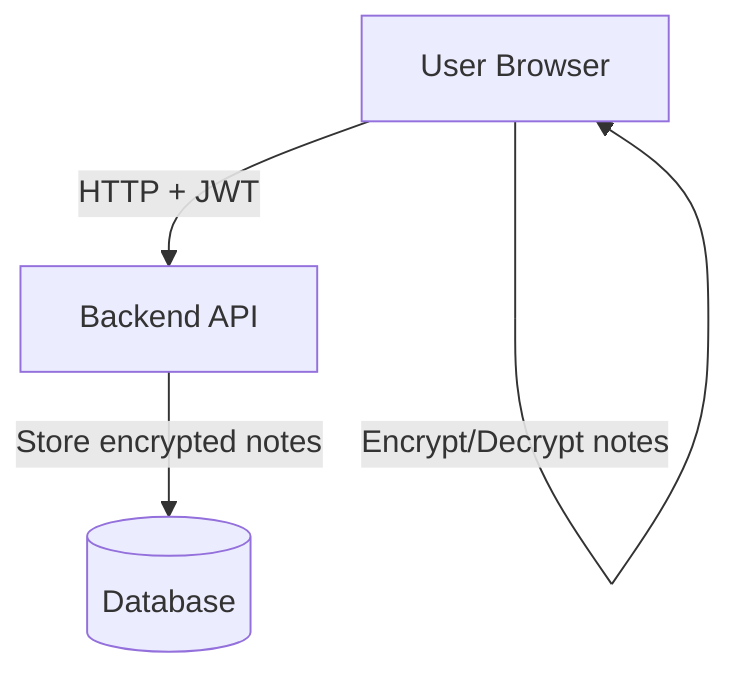

# BEMSI_2025L

## Projekt
**Szyfrowany Notatnik Medyczny** — nowoczesna, bezpieczna aplikacja webowa do zarządzania prywatnymi notatkami medycznymi z pełnym szyfrowaniem po stronie klienta.

---

## Spis treści
- [Opis projektu](#opis-projektu)
- [Technologie](#technologie)
- [Architektura](#architektura)
- [Instrukcje uruchomienia](#instrukcje-uruchomienia)
---

## Opis projektu
Projekt ma na celu stworzenie aplikacji webowej, która pozwala użytkownikom na tworzenie, edytowanie, usuwanie i przeglądanie notatek medycznych w pełni szyfrowanych po stronie klienta. Klucze szyfrujące nigdy nie opuszczają przeglądarki, co zwiększa bezpieczeństwo przechowywanych danych.

---

## Technologie
- **Frontend:** React, TypeScript, React Router, Axios, Web Crypto API
- **Backend:** Node.js, Express, TypeScript, Prisma ORM, PostgreSQL
- **Autoryzacja:** JWT (JSON Web Token)
- **Szyfrowanie:** AES-GCM po stronie klienta (Web Crypto API)
- **Inne:** dotenv, bcrypt, CORS

---

## Architektura
- **Frontend** komunikuje się z backendem przez REST API.
- Backend obsługuje rejestrację, logowanie, autoryzację oraz CRUD zaszyfrowanych notatek.
- Szyfrowanie i deszyfrowanie notatek wykonuje frontend przy pomocy kluczy generowanych i przechowywanych lokalnie w przeglądarce użytkownika.
- Backend przechowuje notatki tylko w formie zaszyfrowanej i nie ma dostępu do kluczy szyfrujących.


---

## Instrukcje uruchomienia na Linuxie (Debian, Ubuntu)

### Backend
1. Sklonuj repozytorium:
   ```bash
   git clone https://github.com/K-Milena/BEMSI_2025L.git
   ```
  
2. Przejdź do folderu backendu (secure-notes-backend) i uruchom serwer wraz z bazą danych:
    ```bash
    npm install
    npm run dev
    ```
    W razie niepowodzenia (błędów) użyj:
   ```bash
   rm -rf node_modules package-lock.json
   npm install
   ```
    
    ```bash
    sudo -u postgres psql -d secure_notes
    ```
    
4. Przejdź do folderu frontendu (secure-notes-frontend) i uruchom aplikację:
    ```bash
    npm install
    npm start
    ```

5. Aplikacja będzie teraz dostępna pod adresem:
    ```bash
    http://localhost:3001
    ```

---

